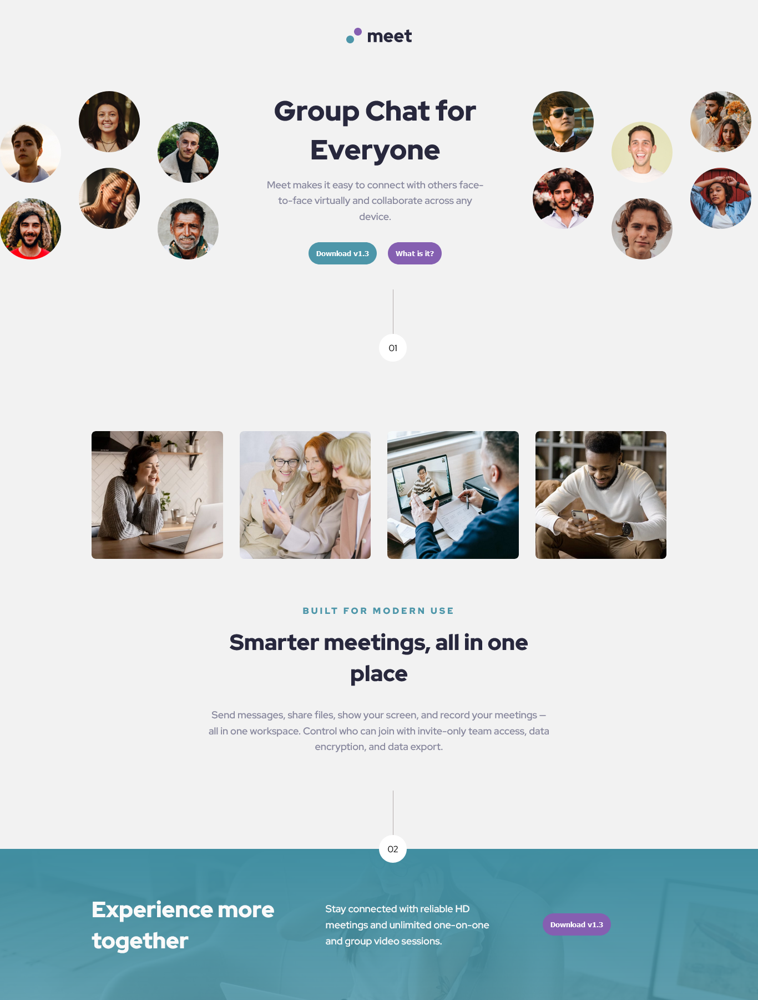
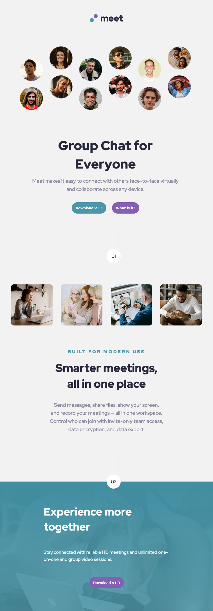
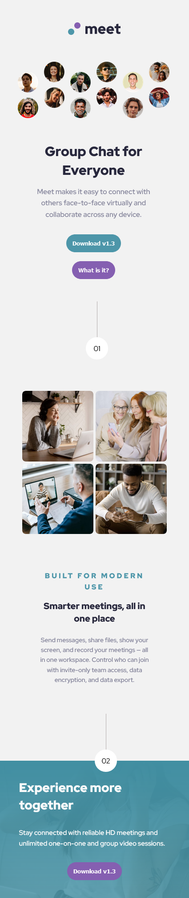

# Frontend Mentor - Meet landing page solution

This is a solution to the [Meet landing page challenge on Frontend Mentor](https://www.frontendmentor.io/challenges/meet-landing-page-rbTDS6OUR). Frontend Mentor challenges help you improve your coding skills by building realistic projects.

## Overview

The Meet landing page challenge HTML & CSS only challenge is perfect if you're starting to get a bit comfortable with your layout skills. The responsive layout shifts will also be a great test!

### The challenge

Users should be able to:

- View the optimal layout depending on their device's screen size
- See hover states for interactive elements

### Screenshot

- Desktop view
  ;

- Tablet view
  ;

- Mobile view
  

### Links

- Solution URL: [Add solution URL here](https://your-solution-url.com)
- Live Site URL: [Add live site URL here](https://your-live-site-url.com)

## My process

- Innitially as I was working on the this project, I first downloaded starter files and set-up the project repository using the few resources that where provided. With the header section having a fact that it is being rendered in various layout on various screen sizes, I used the **CSS Grid** to implement this section and this was smooth to move from one layout to another based on the screen view port width

- I later lone organised my CSS in various files and folder using **The 7 - 1 CSS file structure**, and **BEM** Modal for naming my classes in HTML.

- I also used CSS custom properties to clean up my code from repeatitions. I also began with the Desktop first workflow as I moved down to small media screen and wrote my code to archieve an output as close to the figma design as possible.

### Built with

- Semantic HTML5 markup
- CSS custom properties
- Flexbox
- CSS Grid
- Desktop-first workflow

### What I learned

In this Meet landing page challenge on Frontend Mentor helped me read and learn about the CSS Grid as this technology was so important to archieve a layout close to the figma document.

### Continued development

In building this challenge I discovered some weak areas in CSS Grid and am willing do continue reading various articles and tutorials to equip myself with the knowledge in this area.

## Author

- Frontend Mentor - [@ssembatya-dennis](https://www.frontendmentor.io/profile/ssembatya-dennis)
- Twitter - [@DennisSsembatya](https://twitter.com/DennisSsembatya)
